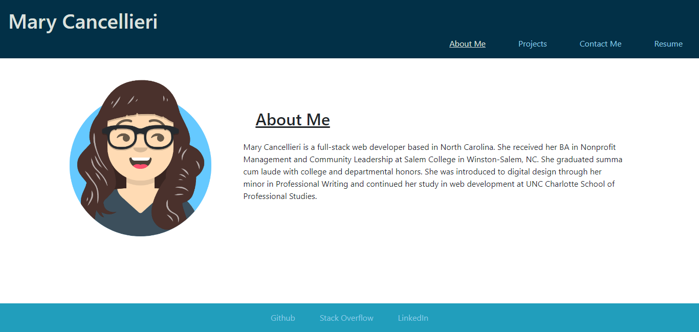
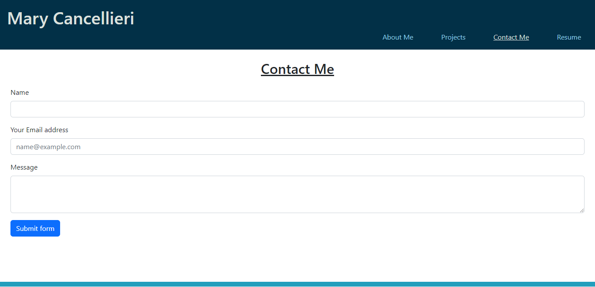
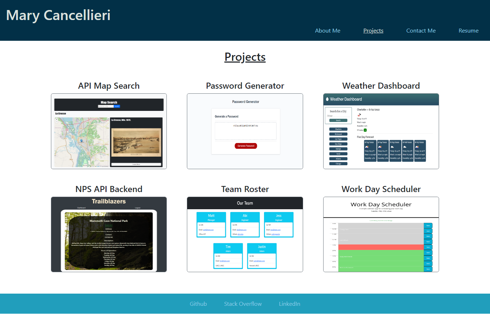
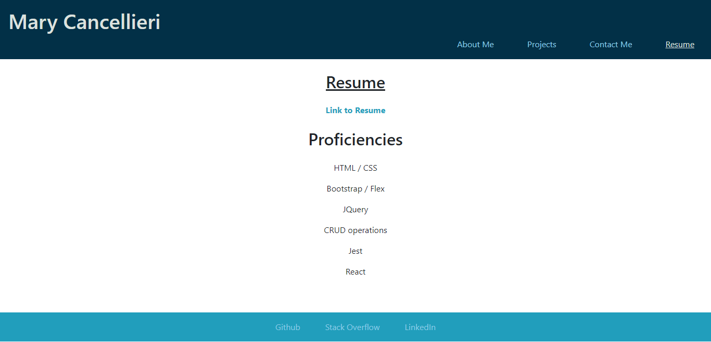

# React Portfolio

[Live Site](https://pure-cove-13092.herokuapp.com/)

## Table of Contents

- [Decription](#description)
- [Visuals](#visuals)

## Description

This portfolio is a single-page application featuring conditionally rendered "pages". Using the navigation bar, users can change tabs between "About Me," "Projects," "Contact Me," and "Resume."

Each project in the "Projects" tab has a link to the corresponding gitHub repository and deployed site. The contact form in the "Contact Me" tab has email validation and required inputs.

This project was bootstrapped with [Create React App](https://github.com/facebook/create-react-app). You can learn more in the [Create React App documentation](https://facebook.github.io/create-react-app/docs/getting-started). To learn React, check out the [React documentation](https://reactjs.org/). Styling is a combination of CSS and [Bootstrap](https://getbootstrap.com/docs/5.0/getting-started/introduction/).

## Visuals

